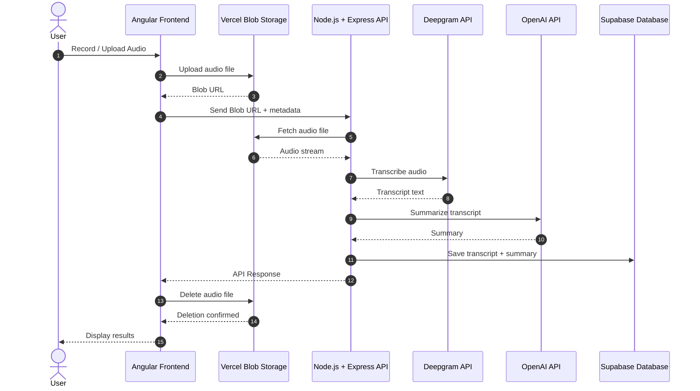

# summarizer

Used to transcribe and summarize long audio files for my mom lol

## System Architecture & Data Flow

Built with angular, node.js + express, deepgram, openai models, vercel blobs, supabase + oauth

## Try it out!

summarize.alexnham.com
